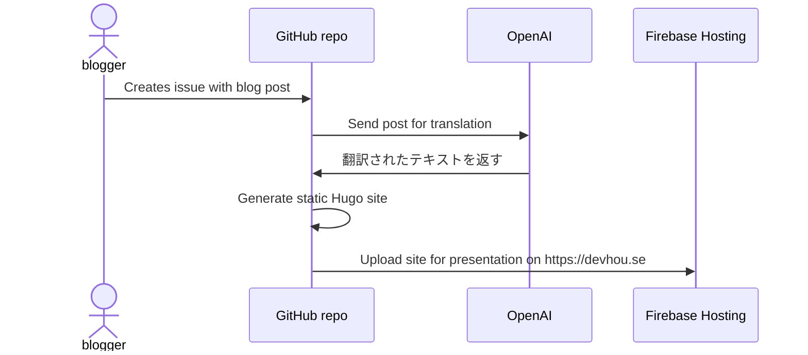

Earlier this year I travelled to Japan with a group of colleagues. We explored
Tokyo and Osaka, and enjoyed plenty of yakiniku, famichiki, and strong zeroes.
As much as we were enjoying our travels, we also wanted to share our experience
as we travelled around with our colleagues and friends back home.

I could have opted for an elegant solution for us, a solution to a problem that
has already been solved - such as WordPress or simple Hugo site. But as a
software engineer, the natural solution is to iterate on the wheel and produce
an even better solution. Given our familiarity with GitHub, it felt like an easy
choice for it to be our platform to interface with for creating our posts.

As software engineers, we were already all using GitHub as part of our jobs. As
such, we already were quite comfortable with using it, and already had accounts
set up. By using it as the blogging platform, it meant that there was no
learning curve (to learning the platform).

GitHub comes with many great features that enable developers. In particular, I
was able to use Issues, Actions, and the GitHub API to create the blogging
workflow. Paired with Firebase hosting and their free hosting and prebuilt
GitHub workflows, I had a full set of services to get a complete blogging
solution built.

The blogging process was simple: 1. Create an issue against the
[blogging repo](https://github.com/devhou-se/www-jp) and confirm the post
with a "`/post`" comment on the issue. 2. A GitHub workflow pulls down the 
contents of the post, puts it into a markdown document for Hugo, (the content
is also sent off to OpenAI to use their LLMs for translating the content into
Japanese). 3. Another GitHub workflow picks up on the markdown file change,
so generates the static site with the new post using Hugo, and uploads the site
to Firebase hosting.

And thanks to how easy GitHub workflows and the GitHub API are
to use, we were able to iterate on the workflow features on our trips, including:

- Auto-translation of posts with OpenAI (this feature wasn't originally avaible)
- Translation into other languages with comment commands on the post issue
- Post reactions (by reacting to the GitHub issue, the reactions were live on
the blog post.)

All together, this created for a beautifully simple process to blog our journey.

*A blog post is created via a GitHub issue*

*The blog post is confirmed by a comment on the issue*

*The blog post is translated and uploaded to the website*

## Reflections

Using GitHub as a platform for blogging seems slightly obsurd, and definitely
not what the service is intended for. However, the capability and flexibility of
their feature set enabled me to do so with much ease. I appreciate how GitHub
has made it so straightforward to build the "auxiliary" services on top of their
platform through things like easily configurable hooks and workflows.

The success of this setup came largely from everyone's familiarity with using
GitHub daily. For users who don't, they would likely be better served by a
solution more tailored to what they are familiar with - may
that be a traditional blogging platform like WordPress.

Would I recemmond everyone waste a week engineering a blogging platform on top 
of GitHub? Probably not. But if you're an engineer that enjoys tailoring
solutions to best enable your users? Why not.
